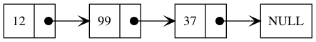

# Basic data structures in C

## Linked lists

The idea is simple, we can have a struct containing data and a pointer to the next element if it exists.



We can declare a simple C structure for this, let's imagine it is designed to hold integers:

```c
typedef struct node {
    int num;
    struct node *next;
} Node, *NodePtr;
```

Because C doesn't have constructors for structs, we can create a helper function `makeNode` to do so, passing the element we want to put in the list:

```c
#include <stdlib.h>

NodePtr makeNode(int num) {
    NodePtr node = (Node *)malloc(sizeof(Node));
    node->num = num;
    node->next = NULL;
    return node;
}
```

We can declare a list similar to the illustration like this:

```c
NodePtr node = makeNode(12);
node->next = makeNode(99);
node->next->next = makeNode(37);
```

### Counting elements

To get the total elements in a linked list, it will be matter of just loop through all of them until we reach an element with next is `NULL`

```c
int length(NodePtr node) {
    if (node == NULL) { return 0; }
    int count = 1;
    while (node->next != NULL) {
        node = node->next;
        count++;
    }
    return count;
}
```

### Searching an element

This is a boring one, in the same way as counting it, we loop through it until we find the element.

```c
NodePtr search(NodePtr top, const int num) {
    NodePtr node = top; // We actually can reuse top
    while (node != NULL) {
        if (node->num == num) { return node; }
        node = node->next;
    }
    return NULL;
}
```

### Finding the last element

As the previous operation, this is matter of looping through the structure until there is no next.

```c
NodePtr last(NodePtr top) {
    while (top != NULL) {
        if (top->next == NULL) { return top; }
        top = top->next;
    }
    return NULL;
}
```

