# Linked list in Go

In simple terms a _linked list_ is a linear collection of _elements_. A linked list is a dynamic data structure where the number of elements in a list is not fixed and can grow and shrink on demand.

An element in a linked list is called _a node_, every node contains a _space_ for _data_ and it always points to its _next_ element.

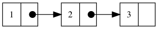

If we are in the _last node_ in the list, the next element is `NULL`.

```go
type node struct {
    value int
    next  *node
}
```

To navigate a list, we start from the beginning of the list (sometimes called _top_) and navigate to the next node pointed by _next_.

This offers our first problem, once we advance to the next node after the first, we need to keep a way to track which one is the first node, we can call this node _head_, the last node in the list is, unsurprisingly, called _tail_.

With this information at hand we can model a type for our list:

```go
type List struct {
    head *node
    tail *node
}
```

## Counting the number of elements

A simple operation is to count the number of elements or nodes in our list, such operation is commonly named _length_, this will require to loop through the elements from the _head_ until the _next_ element in the _current_ node is `NULL` or `nil`

```go
func (l *List) Length() int {
	if l == nil || l.head == nil {
		return 0
	}
	count := 0
	for current := l.head; current != nil; current = current.next {
		count++
	}
	return count
}
```

This is a very common pattern with lists, loop the elements until we reach the end (which is easy to find by just checking its next element).

## Adding new elements to the list

There are three main scenarios when adding a new element to an existing list:

* Adding an element at _the end_ of the list, this is usually known as _appending_ an element
* Adding an element at _the beginning_ of the list
* Adding an element in _the middle_ of the list.

We will discuss each of them with more detail and propose our solution to the operations.

### Append an element at the end

Keeping a link to the _last_ node in the list make appending an element at the end of the list an easy operation, for example, let's assume we already have a list with three nodes, as noted, start and end will point to the first and last node:

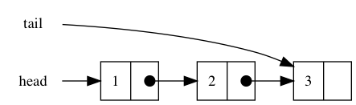

Adding a new node will involve, creating a new node:

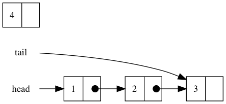

Now we point the _current_ last node _next_ to the new node:

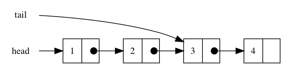

Finally now _tail_ should point to the new node:

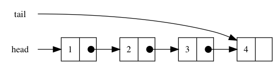

Before going into the code, we should take a few observations and checks to do when adding a new node _at the end_ of our list:

* When _head_ and _tail_ are `nil` we are starting a new list, or well, the list is empty
* With `append`, we will always add the new node at the end of the list.

With this we can now write our first operation, `Append`

```go
func (l *List) Append(value int) {
	elem := &node{value: value}
	if l.head == nil || l.tail == nil {
		l.head, l.tail = elem, elem
		return
	}

	l.tail.next = elem
	l.tail = elem
}
```

### Inserting an element at the beginning

Very similar to the `append` operation, the _next_ node for the new element is the _head_ node in theh list:

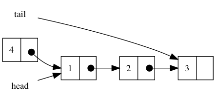

And finally we change the _head_ pointer in the list


### Inserting an element in the middle

This is a little more complicated operation, we need to find the node in the index _before_ the index we want to insert into.

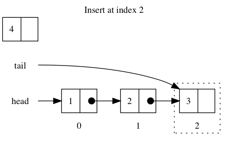

In this case we have to loop until we get to the $\text{index} - 1$, once there, we point the next pointer of the new node to the next element of the previous index

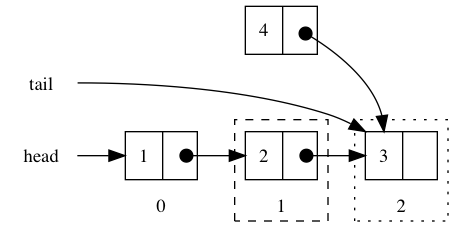

Now, it is just matter of update the next pointer for the $(\text{index} - 1)$ node and it will be done

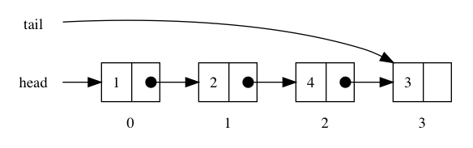

We can create a single function to handle the "at the beginning" and "in the middle" insert operation with the following observations:

* If the list is `nil`, we are probably doing something wrong
* When $\text{index} = 0$ we know we are inserting at the beginning
* When the _next node_ pointed by $index - 1$ is `nil`, we know we are appending at the end

With this, we can write our `InsertAt` function:

```go
func (l *List) InsertAt(index, value int) bool {
	if index == 0 || (l.head == nil && l.tail == nil) {
		l.head = &node{value: value}
		l.tail = l.head
		return true
	}

	current := l.head
	for n := 0; n < index-1; n++ {
		if current == nil {
			return false
		}
		current = current.next
	}

	current.next = &node{value: value, next: current.next}
	return true
}
```

## Retrieve operations

Adding elements to a linked list is fun, but now we need to get the elements _from_ the list, we can classify this in three big groups as well:

* getting an item from the head
* getting an item from the tail
* getting an item from the middle using _its index_

Thanks to the _head_ and _tail_ pointers, writing the `Head` and `Tail` operations should be trivial, I let them as an exercise for you.

Retrieving an element using its index is very similar to the `Length` and `InsertAt` operation, we loop through the elements of the list _until_ we get to the correct _index_, of course, we need to take care of the case when we had reached _the end_ of the list.

```go
func (l *List) GetAt(index int) (int, bool) {
	if l == nil {
		return -1, false
	}

	current := l.head
	for n := 0; n < index; n++ {
		if current == nil {
			return -1, false
		}
		current = current.next
	}
	return current.value, true
}
```

## Remove an element

Removing an element is very similar to the `InsertAt` operation, we start from the _head_ and loop until we get to the desired $\text{index} - 1$ to remove, this is the _previous node_

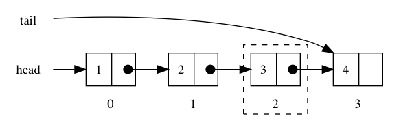

We now point the _next_ pointer from the _previous element_ to the _next_ pointer from the element to remove

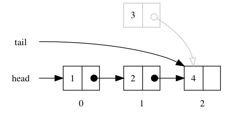

finally we just remove the link from the element to remove and the _garbage collector_ in the Go runtime will take care of it.

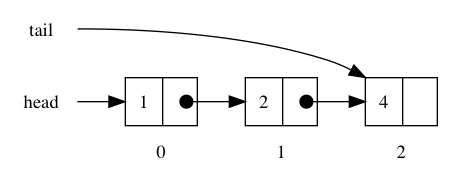

We need to take care into consideration two important cases:

Removing a node from the _beginning_ of the list ($\text{index} = 0$) is matter of moving the `head` pointer

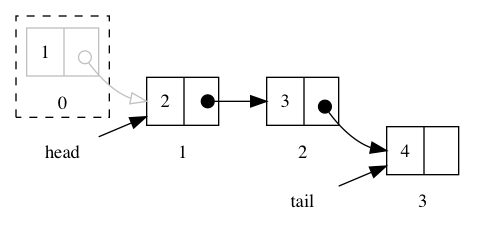

Removing a node from the _end_ of the list ($\text{index} = \text{lenght} - 1$), it is then matter of moving the _tail_ pointer to the _previous_ node and setting the _previous_ next pointer to `nil`.

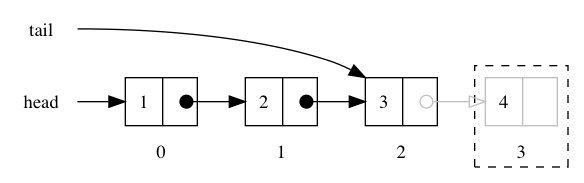

In code this looks something like this:

```go
func (l *List) RemoveAt(index int) bool {
	if l.head == nil {
		return false
	}

	var prev *node
	current := l.head
	for n := 0; n < index; n++ {
		if current == nil {
			return false
		}
		prev, current = current, current.next
	}

	if prev == nil {
		l.head = current.next
	} else {
		prev.next = current.next
	}

	if current == l.tail {
		l.tail = prev
	}

	return true
}
```

## Saving a list to disk

## Specialized list types

### Circular linked list

### Double linked list

### Ordered linked list

